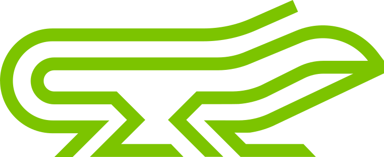

  

<h1 align="center">Lizard Ecosystem</h1>

  <strong>The Operating System for Industry, Craftsmanship, and Field Service.</strong> 
  Built by <a href="https://wus.solutions">Wolf+Strauss Solutions</a>, Bielefeld.

  
  
  

---

Lizard is not just another inventory tool; it is a disruptive B2B service and asset-management platform designed to eliminate operational friction. Built **bottom-up from the construction site and industrial shop floor**, Lizard bridges the gap between physical assets and digital workflows.

## 🏛 The Core Philosophy: "Safe at First Sight"

Traditional software fails because users hate manual data entry and administrative overhead. Lizard solves this through a radical symbiosis of **Active IIoT Hardware**, **AI-driven Automation**, and a **Cloud SaaS Backend**.

* **MDEG Principle (*"Mach Dass Es Geht"*):** Operators and site managers don’t want to fiddle with complex apps. They need legal certainty and a quick look at a green light.
* **Physical Visibility:** Safety and compliance statuses are displayed directly on the object—offline and without pulling out a smartphone.

---

## ⚙️ Key Pillars of the Ecosystem

### 1. Active Hardware (IIoT)

* **Lizard Pro ("The Box"):** An ultra-robust, 4mm stainless steel, ferrite-coated smart tag equipped with NFC, Bluetooth, and an integrated **RGB LED traffic-light system** (Red/Yellow/Green). It shows inspection and safety statuses directly on heavy machinery, scaffolding, or containers with a 10-year battery life.
* **Lizard Show ("The Label"):** A digital e-paper tag that replaces manually updated inspection stickers by automatically updating inspection dates over the air.

### 2. AI-Driven Automation (LISS Engine)

* **The "Data Vacuum Cleaner":** An intelligent OCR and LLM-powered ingestion engine that automatically reads unstructured Excel sheets and PDF inspection protocols (e.g., from TÜV or Dekra).
* **Auto-Matching:** The AI identifies the digital twin of the asset within LizardPro, attaches the document, and autonomously updates inspection deadlines and compliance attributes.

### 3. The Unified SaaS Platform & Workflow Suite

* **Digital Twins:** Centralized, manufacturer-independent management of all safety-relevant assets, tools, and equipment.
* **Service ERP:** Tools for field service providers including scheduling, qualification matrices (ensuring only certified technicians are deployed), and digital protocols signed directly on-site.
* **DynTag & Open Standards:** Seamless browser-based access via dynamic URLs without mandatory app installations for external parties, plus support for existing third-party tags via hash algorithms.

---

## 🌐 The Marketplace Flywheel

Lizard connects three critical players in a unified network loop:

1. **Operators (Customers):** Gain peace of mind, automated compliance, and real-time visibility over their operational assets.
2. **Service Providers (Partners):** Use Lizard as their operational backbone to execute maintenance tasks, manage technicians, and scale efficiently.
3. **Suppliers & Commerce:** Automatically integrated into the loop for just-in-time spare parts ordering as soon as a defect is detected.

---

## 🎬 Lizard in Action

<table>
  <tr>
    <td align="center" width="50%">
       
      ▶️ <a href="https://youtu.be/SwChod0NHaI"><strong>Wer ist Lizard</strong></a>
    </td>
    <td align="center" width="50%">
       
      ▶️ <a href="https://youtu.be/KWyPgr0if2c"><strong>Lizard Videopitch</strong></a>
    </td>
  </tr>
</table>

---

## 📬 Contact

**Wolf+Strauss Solutions** · Bielefeld, Germany

* 🌐 [wus.solutions](https://wus.solutions) · [go-lizard.com](https://go-lizard.com)
* ✉️ [edv-service@wus.solutions](mailto:edv-service@wus.solutions)
* 💼 [Wolf+Strauss Solutions on LinkedIn](https://linkedin.com/company/wolf-strauss-solutions) · [Bastian Strauss on LinkedIn](https://linkedin.com/in/bastianstrauss)
* ▶️ [Lizard on YouTube](https://youtube.com/@go-lizard)
